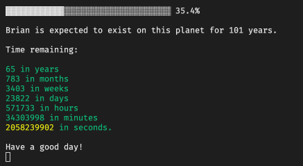

# Timebar CLI

A CLI to get some time progress bars to look at on your terminal. Pretty much an extension of what [this twitter bot](https://twitter.com/year_progress) is doing, reminding you that time is passing by 😱



## Installation

### From [crates.io](https://crates.io/crates/timebar)

```
cargo install timebar
```

### From source

You need cargo to compile from source, which is shipped with Rust.

```
git clone https://github.com/sungyeonkwon/timebar
cargo install --path ./timebar # Compile and install
```

## Basic Usage

Timer and life progress bar update every second until you exit the program, while year and dday progress bar update once and the program exits.

### Year progress

To get this year's progress bar, run `timebar year`.

```
▓▓▓▓▓▓▓▓▓▓▓▓▓▓▓▓▓▓▓▓▓▓▓▓▓▓▓▓▓▓▓▓▓░ 97.7%

This year's almost over!
```

### Life progress

To get your life's progress bar, run `timebar life`. This prompts to enter your name, birthday and expected lifespan.

```
▓▓▓▓▓▓▓▓▓▓▓▓▓▓▓▓▓░░░░░░░░░░░░░░░░ 51.1%

Brian is expected to exist on this planet for 70 years.

Time remaining:

34 in years
411 in months
1786 in weeks
12502 in days
300057 in hours
18003447 in minutes
1080206822 in seconds.

Have a good day!
```

### Timer progress

To get a timer progress bar, run `timebar timer`. This prompts to enter duration.

```
▓░░░░░░░░░░░░░░░░░░░░░░░░░░░░░░░░░ 1.5%

Time is ticking... You have:

0 in hours
5 in minutes
325 in seconds.
```

### D-day progress

To get a d-day progress bar, run `timebar dday`. This prompts to enter a name and the dates.

```
▓▓▓▓▓▓▓▓▓▓▓▓▓▓▓▓▓▓▓▓▓▓▓▓▓░░░░░░░░░ 74.1%

graduation: 541 days are gone, 189 days to go!
```

## Manage entries

Life and d-day can be saved. Data is written to flat files under the active user's home directory (See [preferences](https://docs.rs/preferences/1.1.0/preferences/) library).

#### Save

To save an entry, run `timebar life -s` for a life and `timebar dday -s` for a d-day. Once the information is successfully saved, you'll get the time bar just running `timebar life {NAME}` or `timebar dday {NAME}` next time.

#### List

To get a list of previously saved d-days and lives, run `timebar ls`.

```
TYPE        | NAME        | DURATION
life        | Brian       | 101 years
d-day       | big-trip    | 28/1/1999 - 29/12/2023
d-day       | tiny-battle | 3/12/2020 - 29/12/2022
d-day       | launch      | 3/1/2020 - 29/12/2021
```

#### Remove

To remove a specific previously-saved data, run `timebar rm {NAME}`.
To remove all saved data, run `timebar rm -a`.

## Commands

| Name    | Description                                               | Option/Flag |                 User input                  |
| :------ | :-------------------------------------------------------- | :---------: | :-----------------------------------------: |
| `year`  | Displays the current year's progress.                     |             |                                             |
| `life`  | Displays someone's lifetime progress, given a user input. | -s, {NAME}  |      `{NAME} {BIRTH_DATE} {LIFESPAN}`       |
| `timer` | Displays a timer progress, given a user input.            |             |                  `{TIME}`                   |
| `dday`  | Displays a d-day progress, given a user input.            | -s, {NAME}  | `{NAME} {END_DATE} (Optional:{START_DATE})` |
| `ls`    | Lists all saved d-days and lives.                         |             |                                             |
| `rm`    | Removes saved d-days or lives.                            | -a, {NAME}  |                                             |

### Format requirements

- `DATE`: day/month/year. For example: `1/31/2022`
- `TIME`: hours:minutes:seconds. For example: `0:20:0`
- `NAME`: A string without a space.
